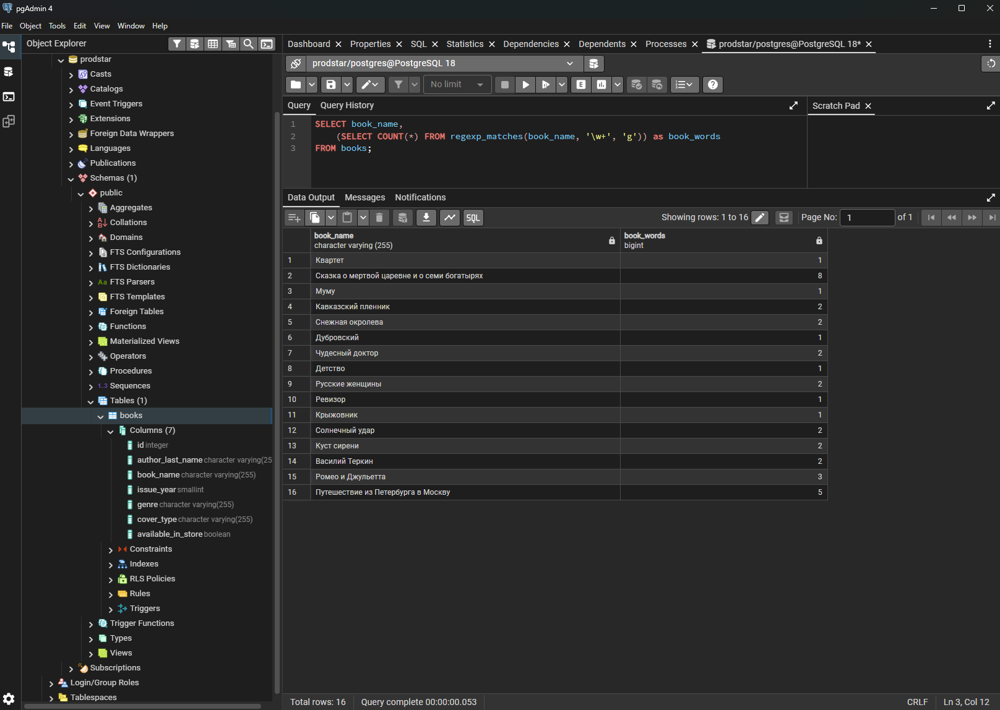
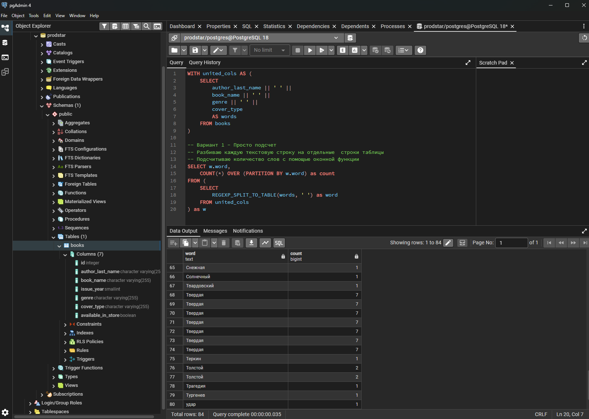
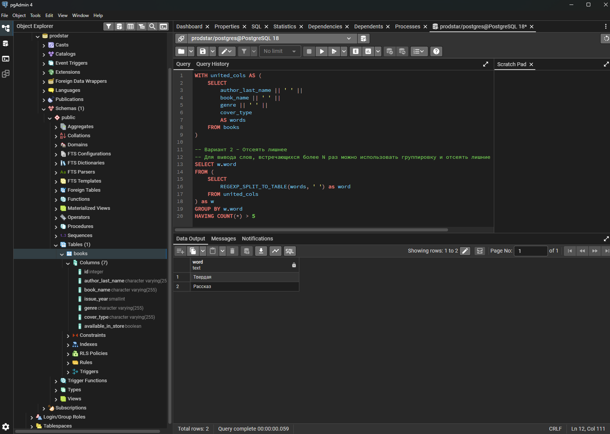
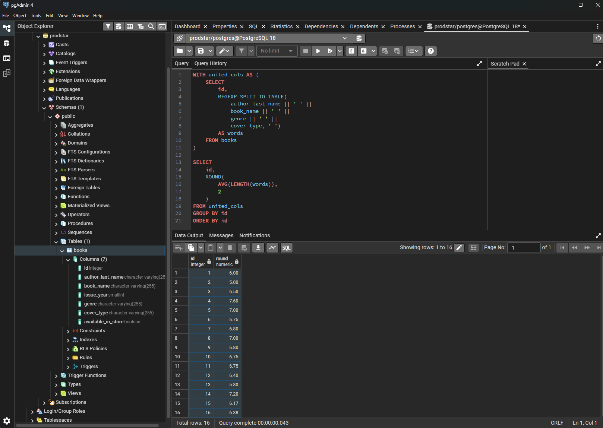
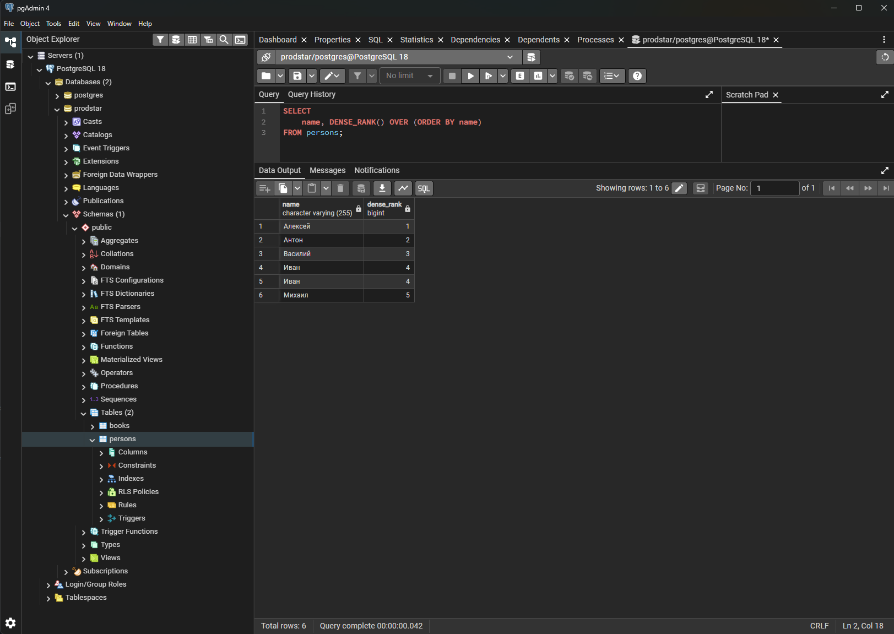
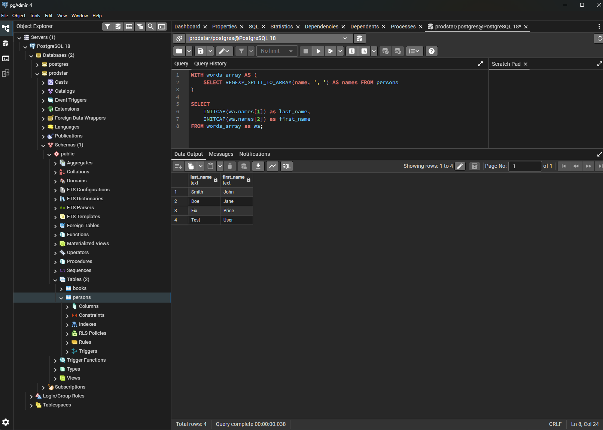

### Задания
1. Напишите запрос SQL, который вычисляет количество слов в каждой строке таблицы «Тексты»
2. Напишите запрос SQL, который находит все слова, которые встречаются в таблице «Тексты» более 10 раз.
3. Напишите запрос SQL, который вычисляет среднюю длину слов в каждой строке таблицы «Тексты»
4. Используя оконные функции, получите ранг каждого пользователя по алфавиту в следующем списке

### Решения

Для заданий 1-3 подготовил таблицу в PostgreSQL

```sql
-- Создал таблицу со структурой из онлайн-документа
CREATE TABLE books (
	id SERIAL,
	author_last_name VARCHAR(255),
	book_name VARCHAR(255),
	issue_year SMALLINT,
	genre VARCHAR(255),
	cover_type VARCHAR(255),
	available_in_store BOOLEAN
);

-- Добавил данные из Google-таблицы
INSERT INTO books (author_last_name, book_name, issue_year, genre, cover_type, available_in_store)
VALUES
    ('Крылов','Квартет',1811,'Басня','Мягкая',true),
    ('Пушкин','Сказка о мертвой царевне и о семи богатырях',1833,'Сказка','Твердая',false),
    ('Тургенев','Муму',1852,'Рассказ','Твердая',true),
    ('Толстой','Кавказский пленник',1872,'Рассказ','Кожаная',true),
    ('Андерсен','Снежная окролева',1844,'Сказка','Мягкая',true),
    ('Пушкин','Дубровский',1833,'Роман','Мягкая',false),
    ('Куприн','Чудесный доктор',1897,'Рассказ','Твердая',true),
    ('Толстой','Детство',1852,'Повесть','Кожаная',false),
    ('Некрасов','Русские женщины',1872,'Поэма','Кожаная',false),
    ('Гоголь','Ревизор',1835,'Комедия','Твердая',true),
    ('Чехов','Крыжовник',1898,'Рассказ','Мягкая',true),
    ('Бунин','Солнечный удар',1925,'Рассказ','Твердая',true),
    ('Куприн','Куст сирени',1894,'Рассказ','Мягкая',false),
    ('Твардовский','Василий Теркин',1942,'Поэма','Кажаная',true),
    ('Шекспир','Ромео и Джульетта',1595,'Трагедия','Твердая',true),
    ('Радищев','Путешествие из Петербурга в Москву',1790,'Повесть','Твердая',true);
```

#### Задание 1. Напишите запрос SQL, который вычисляет количество слов в каждой строке таблицы «Тексты»
```sql
-- Если нужно склеить все текстовые поля, то вместо book_name нужно подставить concat(author_last_name, ' ', book_name, ' ', issue_year, ' ', genre, ' ', cover_type)

SELECT book_name,
	length(book_name) - length(replace(book_name, ' ', '')) + 1 as book_name_length
FROM books;

-- или так
SELECT book_name,
	(SELECT COUNT(*) FROM regexp_matches(book_name, '\w+', 'g')) as book_words
FROM books;
```

Выполнение в СУБД



#### Задание 2. Напишите запрос SQL, который находит все слова, которые встречаются в таблице «Тексты» более 10 раз

```sql
-- Таблица из одной колонки, содержащей объединение текстовых столбцов
WITH united_cols AS (
	SELECT
		author_last_name || ' ' ||
		book_name || ' ' ||
		genre || ' ' ||
		cover_type
		AS words
	FROM books
)

-- Вариант 1 - Просто подсчет (т.к. в таблице нет слов, встречающихся более 10 раз)
-- Разбиваю каждую текстовую строку на отдельные  строки таблицы
-- Подсчитываю количество слов с помощью оконной функции
SELECT w.word,
	COUNT(*) OVER (PARTITION BY w.word) as count
FROM (
	SELECT
		REGEXP_SPLIT_TO_TABLE(words, ' ') as word
	FROM united_cols
) as w
```

```sql
-- Вариант 2 - Отсеять лишнее (для явного вывода оставил слова, встречающиеся более 5 раз)
-- Для вывода слов, встречающихся более N раз можно использовать группировку и отсеять лишние с помощью HAVING
SELECT w.word
FROM (
	SELECT
		REGEXP_SPLIT_TO_TABLE(words, ' ') as word
	FROM united_cols
) as w
GROUP BY w.word
HAVING COUNT(*) > 5
```

Выполнение в СУБД. Вариант 1



Выполнение в СУБД. Вариант 2




#### Задание 3. Напишите запрос SQL, который вычисляет среднюю длину слов в каждой строке таблицы «Тексты»

```sql
-- Немного изменил табличное выражение - добавил id строки для группировки в основном запросе
-- Получается выборка id_строки - слово
WITH united_cols AS (
	SELECT
		id,
		REGEXP_SPLIT_TO_TABLE(
			author_last_name || ' ' ||
			book_name || ' ' ||
			genre || ' ' ||
			cover_type, ' ')
		AS words
	FROM books
)

-- Сгруппировал слова по id строк, к которым они принадлежат и вычислил их среднюю длину
SELECT
	id,
	ROUND(
		AVG(LENGTH(words)),
		2
	)
FROM united_cols
GROUP BY id
ORDER BY id
```

Выполнение в СУБД



#### Задание 4. Используя оконные функции, получите ранг каждого пользователя по алфавиту в следующем списке:

| id | Имя |
| --- | --- |
| 1 | Алексей |
| 2 | Иван |
| 3 | Михаил |
| 4 | Антон |
| 5 | Василий |
| 6 | Иван |


Создал еще одну таблицу в базе данных и наполнил данными
```sql
CREATE TABLE persons (
    id SERIAL,
    name VARCHAR(255)
);

INSERT INTO persons (name)
VALUES
    ('Алексей'),
    ('Иван'),
    ('Михаил'),
    ('Антон'),
    ('Василий'),
    ('Иван');
```

Получил ранг без пропусков
```sql
SELECT
	name, DENSE_RANK() OVER (ORDER BY name)
FROM persons;
```

Выполнение в СУБД




#### Задание 5. Напишите запрос SQL, который разделит строку с именем и фамилией пользователя вида «Smith, John» на два отдельных столбца и приведет к верхнему регистру первую букву имени и фамилии, оставив остальное в нижнем регистре

```sql
-- Воспользовался для воспроизведения той же таблицей persons, старые данные удалил
-- Так исторически сложилось, что сначала добавил новых пользователей (взял произвольные данные)
INSERT INTO persons (name)
VALUES
    ('Smith, John'),
    ('Doe, Jane'),
    ('Fix, Price'),
    ('test, user');
```

```sql
WITH words_array AS (
	SELECT id, REGEXP_SPLIT_TO_ARRAY(name, ', ') AS names FROM persons
)

-- Остальных пришлось стирать опираясь на отсутствие "второго имени"
DELETE FROM persons
WHERE id IN (SELECT wa.id FROM words_array as wa WHERE wa.names[2] IS NULL);
```

```sql
WITH words_array AS (
	SELECT id, REGEXP_SPLIT_TO_ARRAY(name, ', ') AS names FROM persons
)

-- Для приведения к верхнему регистру использовал функцию INITCAP PostgreSQL
SELECT
	INITCAP(wa.names[1]) as last_name,
	INITCAP(wa.names[2]) as first_name
FROM words_array as wa;
```

Выполнение в СУБД



### Ссылки

[Документация PostgreSQL по функциям для работы с текстом](https://www.postgresql.org/docs/current/functions-string.html)