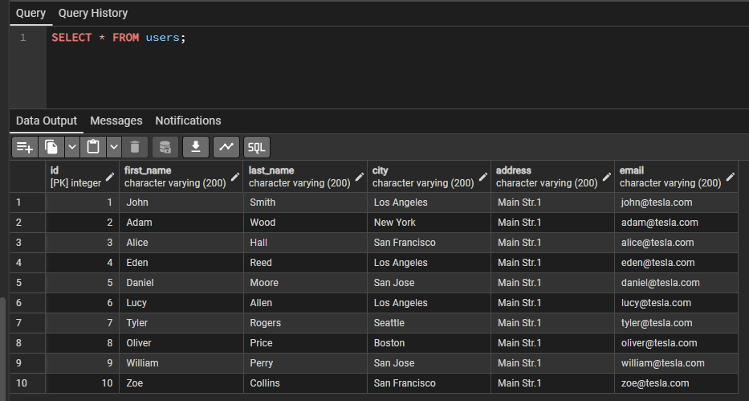
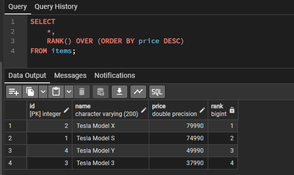

#### Описание

При выполнении используются данные из базы данных `data/tesla_db_data`

#### Создание таблиц
```sql
-- Таблица для хранения данных пользователей
CREATE TABLE users (
	id INTEGER PRIMARY KEY,
	first_name VARCHAR(200),
	last_name VARCHAR(200),
	city VARCHAR(200),
	address VARCHAR(200),
	email VARCHAR(200)
)

-- Таблица для хранения данных о товарах
CREATE TABLE items (
	id INTEGER PRIMARY KEY,
	name VARCHAR(200),
	price FLOAT
)

-- Таблица для хранения данных о заказах пользователей
CREATE TABLE orders (
	id INTEGER PRIMARY KEY,
	user_id INTEGER,
	start_date DATE,
	end_date DATE,
	order_status VARCHAR(20),
	FOREIGN KEY (user_id) REFERENCES users(id)
)

-- Промежуточная таблица для хранения данных о составе заказов
CREATE TABLE order_items (
	id INTEGER PRIMARY KEY,
	order_id INTEGER,
	item_id INTEGER,
	quantity INTEGER,
	FOREIGN KEY (order_id) REFERENCES orders(id),
	FOREIGN KEY (item_id) REFERENCES items(id)
)
```

#### Задания

##### Задача 1. Пуш для пользователей

Задача 1.1. Какая модель Tesla самая продающаяся?

```sql
SELECT
	name as model
FROM items
WHERE id = (
	SELECT item_id
	FROM order_items
	GROUP BY item_id
	ORDER BY SUM(quantity) DESC
	LIMIT 1
);
-- Tesla Model 3
```

Задача 1.2. В какую дату было сделано больше всего продаж?

```sql
SELECT
	start_date, SUM(oi.quantity) AS total_sales
FROM orders AS o
JOIN order_items AS oi
	ON o.id = oi.order_id
GROUP BY start_date
ORDER BY total_sales DESC;
-- 2020-03-01
```

Задача 1.3. Как зовут пользователя, у которого больше всего машин?

```sql
SELECT
	first_name || ' ' || last_name AS username
FROM users
WHERE id = (
	SELECT
		o.user_id
	FROM orders AS o
	JOIN order_items AS oi
		ON o.id = oi.order_id
	GROUP BY o.user_id
	ORDER BY SUM(oi.quantity) DESC
	LIMIT 1
);
-- John Smith
```

Задача 1.4. В каком городе было продано больше всего машин?

```sql
SELECT
	city, SUM(quantity) AS total_sales
FROM orders AS o
JOIN users AS u
	ON o.user_id = u.id
JOIN order_items AS oi
	ON o.id = oi.order_id
GROUP BY u.city
ORDER BY total_sales DESC
LIMIT 1;
-- Los Angeles
```

Задача 1.5. В каком городе средняя цена купленных товаров самая высокая? Укажите эту среднюю цену.

```sql
SELECT
	u.city,
	FLOOR(SUM(i.price * oi.quantity) / SUM(oi.quantity)) AS avg_item_price
FROM orders AS o
JOIN users AS u
	ON o.user_id = u.id
JOIN order_items AS oi
	ON o.id = oi.order_id
JOIN items AS i
	ON oi.item_id = i.id
GROUP BY u.city
ORDER BY avg_item_price DESC;
-- New York, Boston - 74990
```


##### Задача 2. Операции с текстом

Задача 2.1. Объедините имя владельца машины и его город в строку, созданную по следующему шаблону: "ИМЯ_ВЛАДЕЛЬЦА from НАЗВАНИЕ_ГОРОДА", пример требуемой строки - "Anna from Moscow". Из всех записей выбрать ту, которая соответствует владельцу, у которого больше всего машин.

```sql
-- Вынес определение пользователя с наибольшим количеством авто
-- в табличное выражение для лучшей читаемости
WITH top_user AS (
	SELECT
		o.user_id as user_id
	FROM orders AS o
	JOIN order_items AS oi
		ON o.id = oi.order_id
	GROUP BY o.user_id
	ORDER BY SUM(oi.quantity) DESC
	LIMIT 1
)

-- Основной запрос - формирование строки по шаблону + фильтрация
SELECT
	first_name || ' from ' || city as user_info
FROM users
WHERE id = (SELECT user_id FROM top_user)
-- John from Los Angeles
```

Задача 2.2. Посчитайте количество символов в email пользователя с id = 9

```sql
SELECT
	email,
	LENGTH(email) AS email_len
FROM users
WHERE id = 9
-- 19
```

Задача 2.3. Замените example в имейлах пользователей на Tesla

```sql
UPDATE users
SET email = REPLACE(email, '@example', '@tesla');
```




##### Задача 3. Представления и табличные выражения

Задача 3.1. Создайте представление с пользователями из Лос-Анжелеса и обратитесь к нему при помощи запроса.

```sql
CREATE VIEW la_users_view AS (
	SELECT
		*
	FROM users
	WHERE city = 'Los Angeles'
);

SELECT * FROM la_users_view;
```

Задача 3.2. Создайте табличное выражение с теми же условиями и обратитесь к нему при помощи запроса.

```sql
WITH la_users AS (
	SELECT
		*
	FROM users
	WHERE city = 'Los Angeles'
)

SELECT * FROM la_users;
```


##### Задача 4. Ускорение и оптимизация запросов

Задача 4.1. Создайте два индекса для полей order_id и item_id таблицы order_items.

```sql
CREATE INDEX idx_order_items_order_id
ON order_items (order_id);

CREATE INDEX idx_order_items_item_id
ON order_items (item_id);
```

Задача 4.2. Выполните запрос и изучите, что написано в плане запроса.

```sql
-- Для примера создал такой запрос
EXPLAIN SELECT
	*
FROM orders
JOIN users
	ON orders.user_id = users.id
WHERE users.city = 'Los Angeles'
ORDER BY users.first_name

-- Вывод
-- Sort  (cost=31.17..31.24 rows=27 width=2168)
--   Sort Key: users.first_name
--   ->  Hash Join  (cost=10.39..30.53 rows=27 width=2168)
--         Hash Cond: (orders.user_id = users.id)
--         ->  Seq Scan on orders  (cost=0.00..18.00 rows=800 width=74)
--         ->  Hash  (cost=10.38..10.38 rows=1 width=2094)
--               ->  Seq Scan on users  (cost=0.00..10.38 rows=1 width=2094)
--                     Filter: ((city)::text = 'Los Angeles'::text)
```

План выполнения:
- Выполняется полное сканирование таблицы `users`
  - Применяется фильтр. Ожидается, что вернется одна строка длиной примерно в 2094 байта
- Выполняется полное сканирование таблицы `orders`. Ожидается, что будет возвращено 800 строк в среднем по 74 байта
- Выполняется объединение строк по условию `orders.user_id = users.id`. Ожидается, что останется 27 строк после объединения длиной в среднем по 2168 байт
- Выполняется сортировака по полю `first_name`

Вывод `EXPLAIN ANALYZE`
```
Sort  (cost=31.17..31.24 rows=27 width=2168) (actual time=0.045..0.045 rows=4.00 loops=1)
  Sort Key: users.first_name
  Sort Method: quicksort  Memory: 25kB
  Buffers: shared hit=2
  ->  Hash Join  (cost=10.39..30.53 rows=27 width=2168) (actual time=0.027..0.029 rows=4.00 loops=1)
        Hash Cond: (orders.user_id = users.id)
        Buffers: shared hit=2
        ->  Seq Scan on orders  (cost=0.00..18.00 rows=800 width=74) (actual time=0.012..0.012 rows=12.00 loops=1)
              Buffers: shared hit=1
        ->  Hash  (cost=10.38..10.38 rows=1 width=2094) (actual time=0.009..0.010 rows=3.00 loops=1)
              Buckets: 1024  Batches: 1  Memory Usage: 9kB
              Buffers: shared hit=1
              ->  Seq Scan on users  (cost=0.00..10.38 rows=1 width=2094) (actual time=0.006..0.007 rows=3.00 loops=1)
                    Filter: ((city)::text = 'Los Angeles'::text)
                    Rows Removed by Filter: 7
                    Buffers: shared hit=1
```

- На самом деле при сканировании таблицы `users` и фильтрации было возвращено 3 строки (7 в выборку не попали). Данные самой таблицы лежали в кэше, загрузки с диска не производилось
- Затем было выполнено сканирование таблицы `orders` - чтение данных также из кэша, получено 12 строк (а не 800 как было рассчитано планировщиком)
- Таблицы были объеденены по условию `orders.user_id = users.id`, в результате чего получено 4 строки
- Итоговая выборка была отсортирована методом quicksort по ключу `first_name`


##### Задача 5. Оконные функции

Задача 5.1. Отсортируйте автомобили по цене при помощи функции rank()

```sql
SELECT
	*,
	RANK() OVER (ORDER BY price DESC)
FROM items;
```



Задача 5.2. Создайте отчет в виде таблицы, который для каждой даты заказа покажет общее количество проданных машин за этот конкретный день и накопленный итог проданных машин с начала учета данных по этот день включительно (по дням в порядке возрастания даты)

```sql
-- Количество проданных машин в конкретный день (вычисление суммы для группы по start_date)
-- SUM(oi.quantity) OVER (PARTITION BY o.start_date) AS sold_on_date

-- Количество машин накопленным итогом (окно для рассчета суммы формируется с помощью ORDER BY)
-- SUM(oi.quantity) OVER (ORDER BY o.start_date) AS total_sold_on_date

SELECT
	*,
	SUM(oi.quantity) OVER (PARTITION BY o.start_date) AS sold_on_date,
	SUM(oi.quantity) OVER (ORDER BY o.start_date) AS total_sold_on_date
FROM orders AS o
JOIN order_items as oi
	ON o.id = oi.order_id;
```

#### Ссылки

- [EXPLAIN в PostgreSQL](https://www.postgresql.org/docs/10/using-explain.html)
- [Хорошая статья по оконным функциям](https://thisisdata.ru/blog/uchimsya-primenyat-okonnyye-funktsii/)