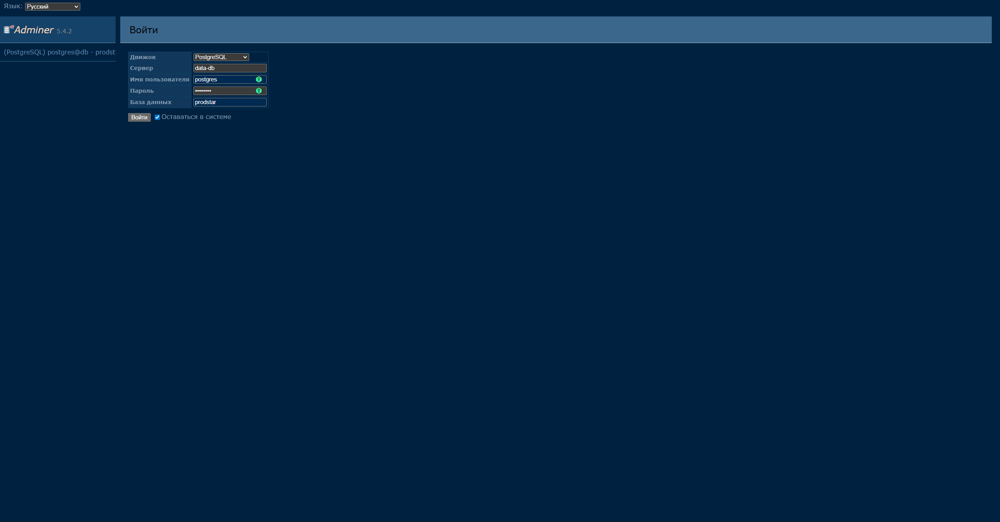
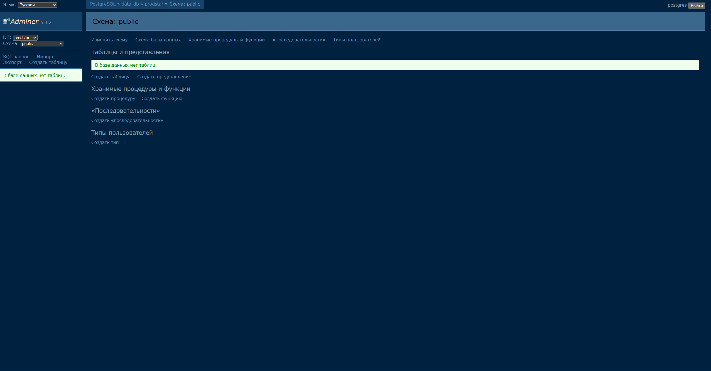
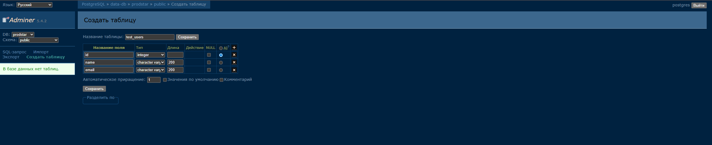
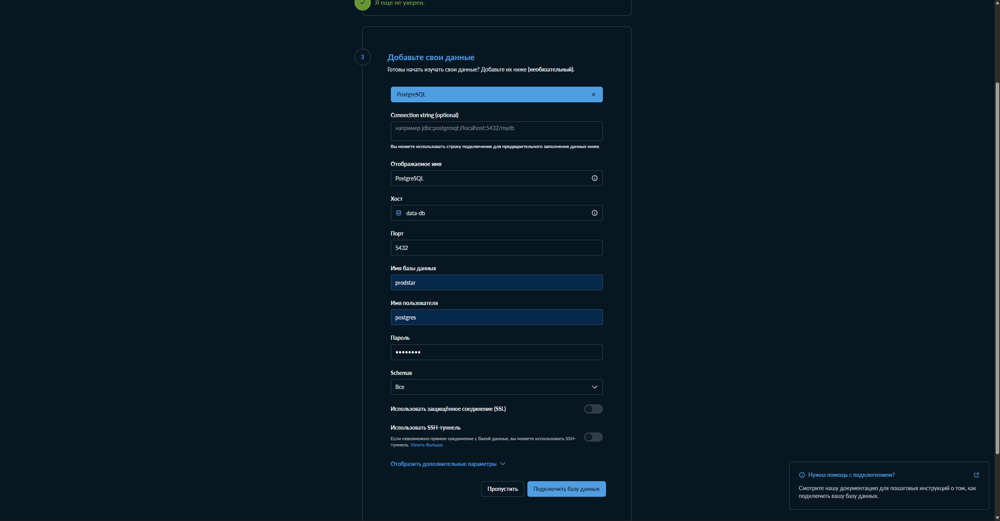

Metabase - это BI-инструмент, позволяющий подключаться к базе данных и визуализировать ее содержимое, собирать дашборды

### Схема проекта

Есть инструмент для визуализации данных Metabase (`metabase-bi`) и база данных (`metabase-db`), которая необходима для его работы (хранения артефактов, которые генерирует непосредственно приложение Metabase). Дашборды в этом инструменте будут строиться на основе данных из базы данных-источника (`data-db`), управление которой будет производиться через UI (`adminer`)


Таким образом, взаимодействие с базами данных ведется либо через приложение Metabase, либо через специальный интерфейс, позволяющий с помощью UI-элементов управлять их структурой и содержимым

### Настройки

Ниже приведены тестовые настройки окружения для различных сервисов, используемых в проекте

Содержимое файла /env/data-db.env
```bash
# Имя суперпользователя, который создается для подключения
# к базе данных при запуске сервиса data-db
POSTGRES_USER=postgres

# Пароль для суперпользователя
POSTGRES_PASSWORD=postgres

# Имя базы данных, которая создается при первом запуске
POSTGRES_DB=prodstar
```

Содержимое файла /env/metabase-db.env
```bash
# По аналогии с /env/data-db.env только для сервиса metabase-db
POSTGRES_USER=postgres
POSTGRES_PASSWORD=postgres
POSTGRES_DB=metabase
```

Содержимое файла /env/metabase-bi.env
```bash
# Используемая СУБД
MB_DB_TYPE=postgres
# Хост, на котором расположена база данных
MB_DB_HOST=metabase-db
# Порт для подключения к базе данных
MB_DB_PORT=5432
# Имя базы данных, к которой можно подключиться
MB_DB_DBNAME=metabase
# Имя пользователя и пароль для подключения к базе данных
MB_DB_USER=postgres
MB_DB_PASS=postgres
```

### Запуск

Запуск сервисов осуществляется с помощью Docker Compose. Всего поднимается 4 сервиса:
- `data-db` База данных PostgreSQL для хранения произвольных данных (источник данных)
- `metabase-db` База данных PostgreSQL для хранения данных, генерируемых Metabase
- `adminer` Интерфейс для удобного управления базой данных Adminer
- `metabase-bi` Инструмент BI-аналитики Metabase


```bash
# Для запуска, выполнить команду в корне проекта
docker compose up

# Проверка состояния контейнеров
docker ps --format "table {{.ID}}\t{{.Names}}\t{{.Status}}\t{{.Ports}}"
CONTAINER ID   NAMES                    STATUS                    PORTS
cf856890d7e5   bi-group-adminer-1       Up 25 seconds             0.0.0.0:8080->8080/tcp, [::]:8080->8080/tcp
d1690f52ca32   bi-group-metabase-bi-1   Up 25 seconds             0.0.0.0:3000->3000/tcp, [::]:3000->3000/tcp
a6d06358ad52   bi-group-data-db-1       Up 31 seconds (healthy)   5432/tcp
88c2cbc94f35   bi-group-metabase-db-1   Up 31 seconds (healthy)   5432/tcp
```


- Доступ к интерфейсу управления базой данных можно получить по ссылке: http://localhost:8080/

Подключение к базе данных


Интерфейс


Создание таблицы через UI


- Доступ к BI можно получить по ссылке: http://localhost:3000/

Подключение к базе данных
