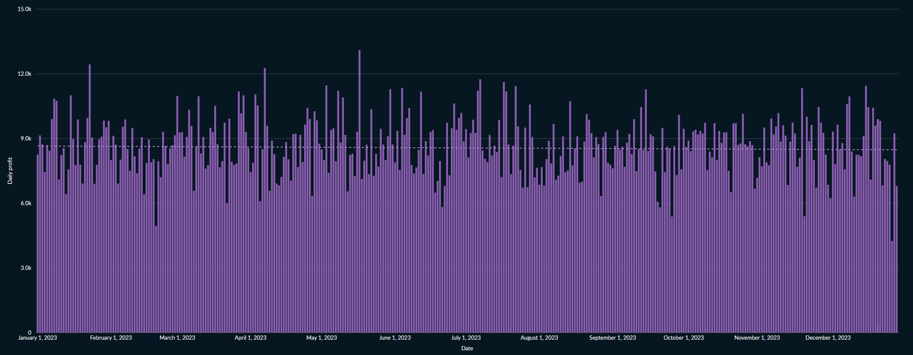
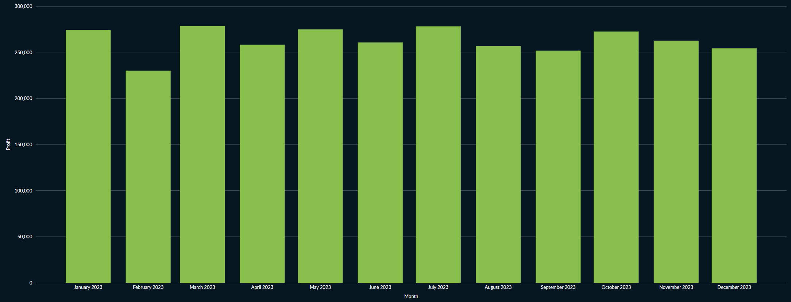
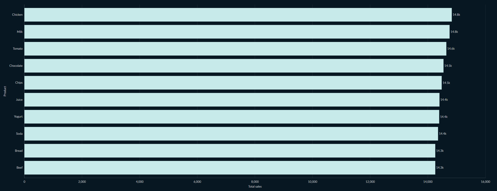
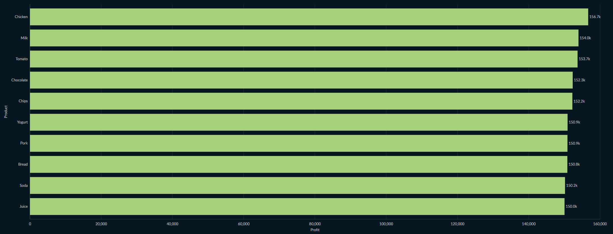
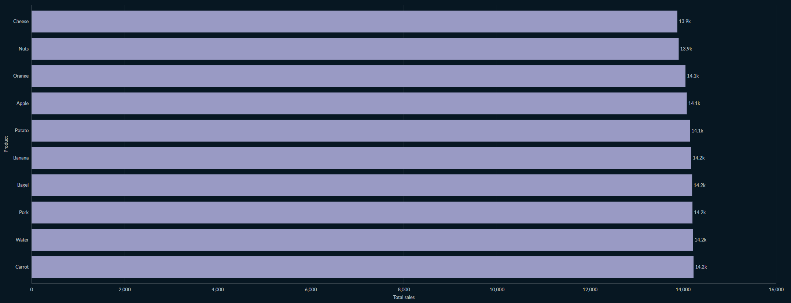
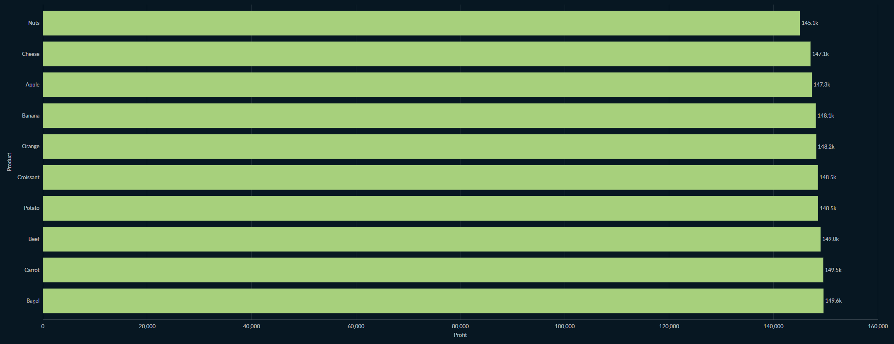
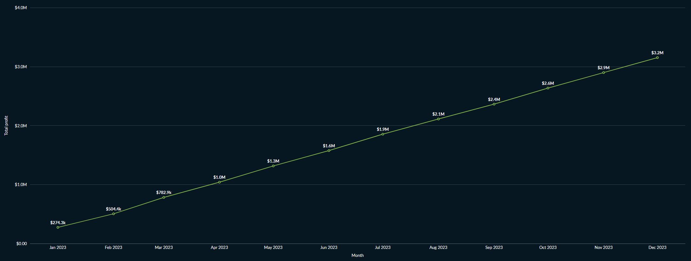
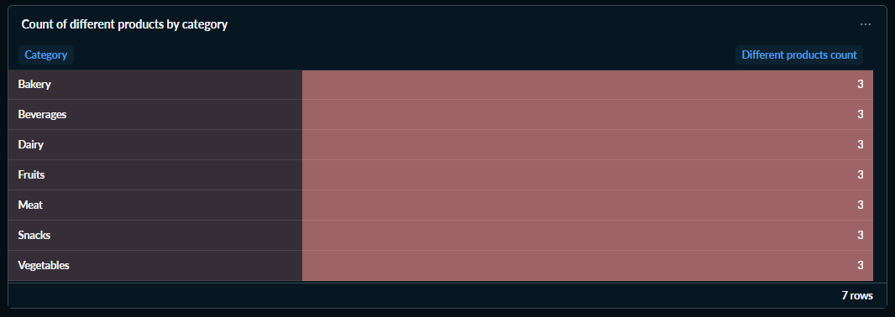
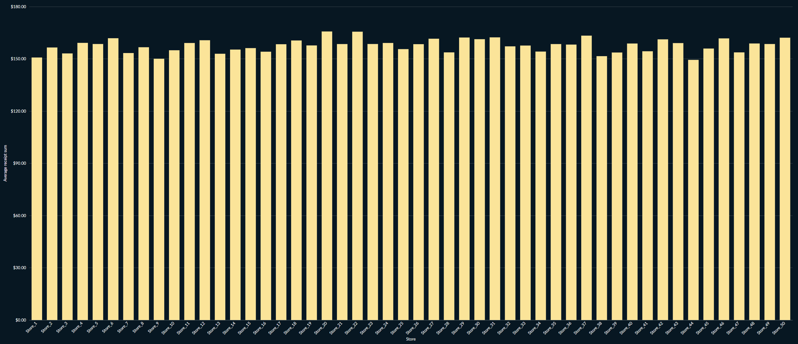
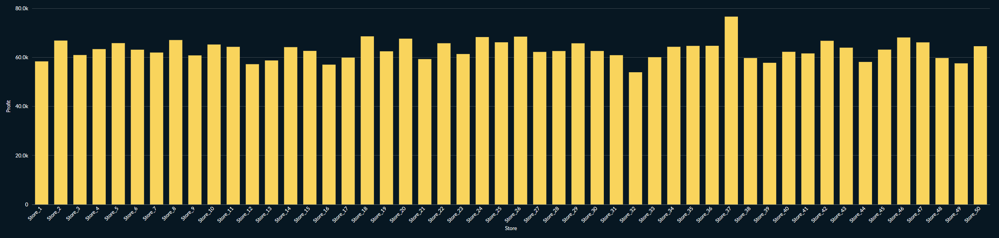

Metabase - это BI-инструмент, позволяющий подключаться к базе данных и визуализировать ее содержимое, собирать дашборды


### Схема проекта

Есть инструмент для визуализации данных Metabase (`metabase-bi`) и база данных (`metabase-db`), которая необходима для его работы (хранения артефактов, которые генерирует непосредственно приложение Metabase). Дашборды в этом инструменте будут строиться на основе данных из базы данных-источника (`data-db`), управление которой будет производиться через UI (`adminer`)


Таким образом, взаимодействие с базами данных ведется либо через приложение Metabase, либо через специальный интерфейс, позволяющий с помощью UI-элементов управлять их структурой и содержимым

### Настройки

Ниже приведены тестовые настройки окружения для различных сервисов, используемых в проекте

Содержимое файла /env/data-db.env
```bash
# Имя суперпользователя, который создается для подключения
# к базе данных при запуске сервиса data-db
POSTGRES_USER=postgres

# Пароль для суперпользователя
POSTGRES_PASSWORD=postgres

# Имя базы данных, которая создается при первом запуске
POSTGRES_DB=prodstar
```

Содержимое файла /env/metabase-db.env
```bash
# По аналогии с /env/data-db.env только для сервиса metabase-db
POSTGRES_USER=postgres
POSTGRES_PASSWORD=postgres
POSTGRES_DB=metabase
```

Содержимое файла /env/metabase-bi.env
```bash
# Используемая СУБД
MB_DB_TYPE=postgres
# Хост, на котором расположена база данных
MB_DB_HOST=metabase-db
# Порт для подключения к базе данных
MB_DB_PORT=5432
# Имя базы данных, к которой можно подключиться
MB_DB_DBNAME=metabase
# Имя пользователя и пароль для подключения к базе данных
MB_DB_USER=postgres
MB_DB_PASS=postgres
```

### Запуск

Запуск сервисов осуществляется с помощью Docker Compose. Всего поднимается 4 сервиса:
- `data-db` База данных PostgreSQL для хранения произвольных данных (источник данных)
- `metabase-db` База данных PostgreSQL для хранения данных, генерируемых Metabase
- `adminer` Интерфейс для удобного управления базой данных Adminer
- `metabase-bi` Инструмент BI-аналитики Metabase


```bash
# Для запуска, выполнить команду в корне проекта (bi-analytics/)
# Можно запустить в фоновом режиме, добавив флаг -d
docker compose up

# Проверка состояния контейнеров
docker ps --format "table {{.ID}}\t{{.Names}}\t{{.Status}}\t{{.Ports}}"
CONTAINER ID   NAMES                    STATUS                    PORTS
cf856890d7e5   bi-group-adminer-1       Up 25 seconds             0.0.0.0:8080->8080/tcp, [::]:8080->8080/tcp
d1690f52ca32   bi-group-metabase-bi-1   Up 25 seconds             0.0.0.0:3000->3000/tcp, [::]:3000->3000/tcp
a6d06358ad52   bi-group-data-db-1       Up 31 seconds (healthy)   5432/tcp
88c2cbc94f35   bi-group-metabase-db-1   Up 31 seconds (healthy)   5432/tcp
```

---

Доступ к интерфейсу управления базой данных можно получить по адресу `http://localhost:8080/`

Подключение к базе данных


Интерфейс


Создание таблицы через UI


---

Доступ к BI можно получить по адресу `http://localhost:3000/`

Подключение к базе данных


---

### Запросы для дашборда

Общая прибыль
```sql
WITH receipt_totalcost AS (
	SELECT
		SUM(totalcost) AS total_by_receipt
	FROM receipts
	GROUP BY receiptid
)

SELECT SUM(total_by_receipt) AS total_profit FROM receipt_totalcost;
-- $3,152,679.82
```

Средняя цена одного купленного товара
```sql
SELECT
	SUM(price * quantity)/SUM(quantity) AS avg_item_cost
FROM receipts;
-- $10.50
```

Выручка по дням
```sql
SELECT
    ts::DATE AS date,
    SUM(totalcost) AS daily_profit
FROM receipts
GROUP BY ts::DATE
ORDER BY date;
```



Выручка по месяцам
```sql
SELECT
    TO_CHAR(ts::DATE, 'YYYY-MM') || '-01' AS date,
    SUM(totalcost) FROM receipts
GROUP BY TO_CHAR(ts::DATE, 'YYYY-MM')
ORDER BY date;
```



Самый популярный продукт
```sql
SELECT product, SUM(quantity) AS total_sales
FROM receipts
GROUP BY product
ORDER BY total_sales DESC
LIMIT 1;
-- Chicken
```

Топ-10 популярных продуктов
```sql
SELECT product, SUM(quantity) AS total_sales
FROM receipts
GROUP BY product
ORDER BY total_sales DESC
LIMIT 10;
```



Топ-10 продуктов, приносящих наибольшую выручку
```sql
SELECT
	product,
	SUM(totalcost) AS profit
FROM receipts
GROUP BY product
ORDER BY profit DESC
LIMIT 10;
```



Самая популярная категория товаров
```sql
SELECT
	category, SUM(quantity) AS total_sales
FROM receipts
GROUP BY category
ORDER BY total_sales DESC
LIMIT 1;
-- Meat
```

Самый не популярный продукт
```sql
SELECT
	product, SUM(quantity) AS total_sales
FROM receipts
GROUP BY product
ORDER BY total_sales ASC
LIMIT 1;
-- Cheese
```

Топ-10 не популярных продуктов
```sql
SELECT
	product, SUM(quantity) AS total_sales
FROM receipts
GROUP BY product
ORDER BY total_sales ASC
LIMIT 10;
```



Топ-10 продуктов, приносящих наименьшую выручку
```sql
SELECT
	product,
	SUM(totalcost) AS profit
FROM receipts
GROUP BY product
ORDER BY profit ASC
LIMIT 10;
```



Самая не популярная категория товаров
```sql
SELECT category, SUM(quantity) AS total_sales
FROM receipts
GROUP BY category
ORDER BY total_sales ASC
LIMIT 1;
-- Fruits
```

Выручка нарастающим итогом по месяцам
```sql
SELECT
	DISTINCT TO_CHAR(ts::DATE, 'YYYY-MM') || '-01' AS date_month,
	SUM(totalcost) OVER (ORDER BY TO_CHAR(ts::DATE, 'YYYY-MM')) AS total_profit
FROM receipts
ORDER BY total_profit ASC;
```



Количество товаров (разнообразие) в каждой категории
```sql
SELECT category, COUNT(*) AS different_products_count
FROM (
	SELECT DISTINCT category, product
	FROM receipts
) AS t
GROUP BY category;
```



Средний чек
```sql
SELECT AVG(receipt_sum) AS avg_receipt_sum
FROM (
	SELECT
		receiptid,
		SUM(totalcost) AS receipt_sum
	FROM receipts
	GROUP BY receiptid
);
-- $157,63
```

Средний чек по магазинам
```sql
WITH receipts_by_store AS (
	SELECT
		storeid,
		receiptid,
		SUM(totalcost) AS receipt_sum
	FROM receipts
	GROUP BY storeid, receiptid
)

SELECT
	storeid,
	AVG(receipt_sum) AS avg_receipt_sum
FROM receipts_by_store
GROUP BY storeid
ORDER BY LENGTH(storeid), storeid;
```



Выручка по магазинам
```sql
SELECT
	storeid,
	SUM(totalcost) AS sum_by_store
FROM receipts
GROUP BY storeid
ORDER BY LENGTH(storeid), storeid;
```

